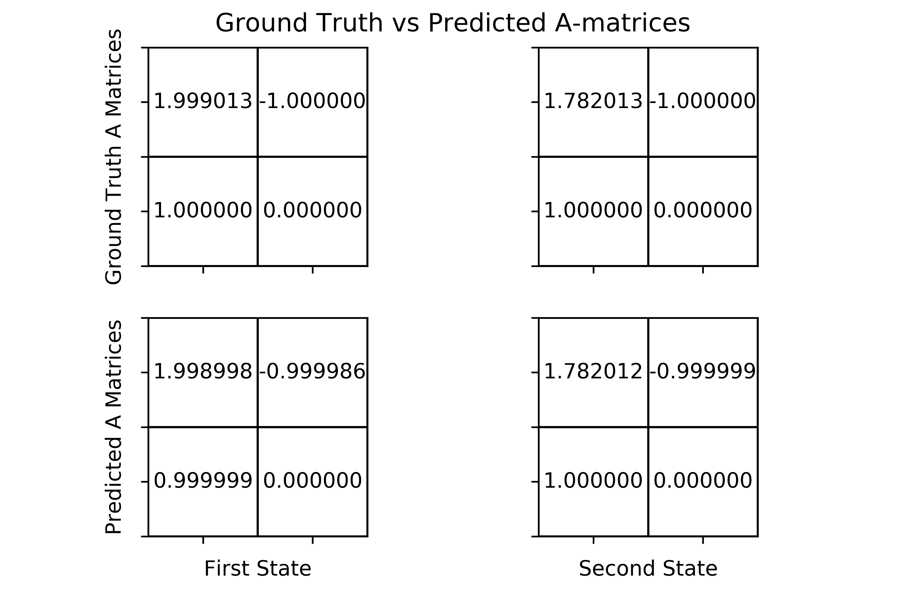
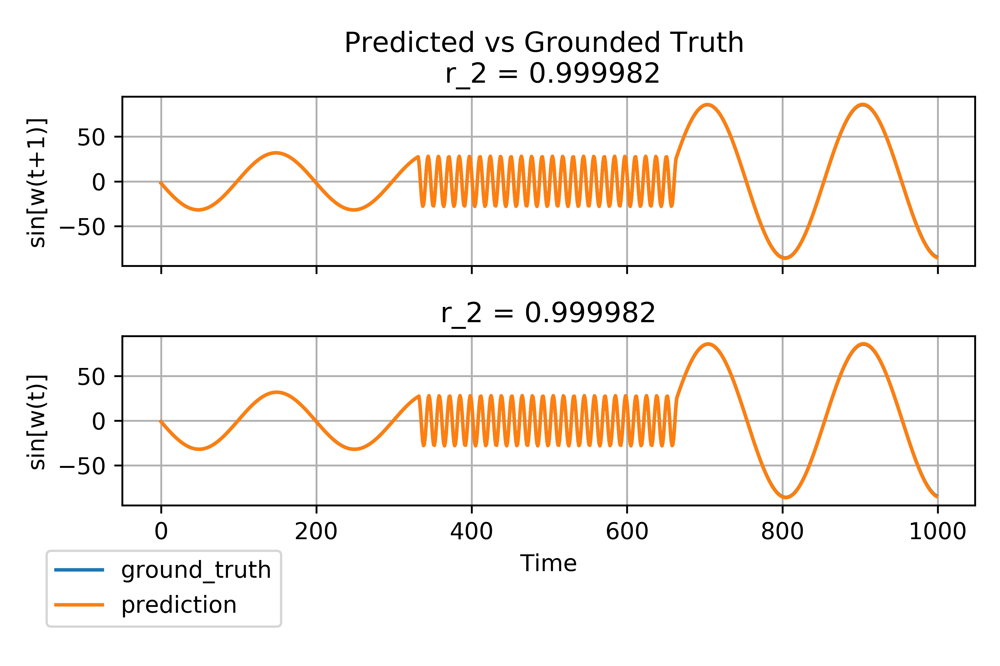

##sticky-HDP-HMM-Vector Autoregression
A python implementation of the sticky-HDP-HMM-VAR model[1].  
For a fast implementation of stable HMM algorithms[2] some functions were implemented in C++.

## The algorithm in a nutshell
The sticky-HDP-HMM-VAR is a Bayesian non-parametric machine learning algorithm that models complex non-linear dynamical phenomena by conditionally switching between linear-dynamical systems (SLDS). 
Each different linear dynamical mode is called an SLDS mode.  
Vector Autoregression is a special SLDS case in which each observation is modeled as a linear function of the previous observations.   
A Hidden Markov Model (HMM) governs the switching between SLDS modes such that each SLDS mode has a corresponding  HMM state.   
A nonparametric Bayesian approach utilizes a hierarchical Dirichlet process (HDP) such that the number of HMM states can be inferred from the data. The model is called sticky as a bias is introduced towards the self-transition probability of each state increasing state persistence. 
For a proper explanation, see 

The VAR equation is given by:  
  
where z(t) is the HMM-state/SLDS-mode at time t and r is the VAR order.

### Setup
As part of the code is run in c++, one needs to compile the c++ part.  
Please run the following commands from within the `utils/math` directory:
> g++ -std=c++11 -Wall -Wextra -pedantic -c -fPIC c_extensions.cpp -o c_extensions.o  
> g++ -shared c_extensions.o -o c_extensions.dylib

*Note - the code was tested and compiled with `g++` but will probably work with any other compiler*

## Running the model
All of the methods needed to run the model are part of a class in `model/sticky_hdp_hmm_var.py`.
A class instance is initialized with uninformative priors and default training parameters.
These priors and parameters may be changed. See `parameters.py` for a description. 

Training a model requires a specific data format generated with
 the `generate_data_structure` method in `utils/data_preparation.py`.  
Once the data is in the correct format the method `train` of the model instance trains the model.
A trained model can predict a state-sequence to fit a given data best using the `predict_state_sequence` method of the model's instance. State-sequence is done via the Viterbi algorithm[3].
The method `predict_observations` generate observations from a given initial point through the VAR equation following the corresponding state-sequence and SLDS mode values (A-matrices).

### Notebook Example
As a sanity check, one can construct observations from a state-space representation of different sine-waves originating from known A-matrices and verify that the models can match the number of states, their switching times the values of their A-matrices to reconstruct the observations. 
In the notebook `sine_wave.ipynb` and train the model on it.
The notebook currently contains an example of observations generated via two sine-waves that inter-switch three times.
Comparing the A-matrices of the sine-waves (ground truth) and the A-matrices of the model trained on these waves 
results in nearly identical values

Generating observations using the trained model's A-matrices vs the ground truth makes it very difficult to observe the differences. 

## References
[1] Emily Fox, Erik B. Sudderth, Michael I. Jordan, and Alan S. Willsky. Nonparametric
bayesian learning of switching linear dynamical systems. In D. Koller, D. Schuurmans,
Y. Bengio, and L. Bottou, editors, Advances in Neural Information Processing Systems 21,
pages 457–464. Curran Associates, Inc., 2009.  
https://arxiv.org/abs/1003.3829  
[2] Tobias P. Mann.  Numerically stable hidden markov model implementation.Ms. Feb,2006  
http://citeseerx.ist.psu.edu/viewdoc/summary?doi=10.1.1.322.9645  
[3] L. R. Rabiner, "A tutorial on hidden Markov models and selected applications in speech recognition," in Proceedings of the IEEE, vol. 77, no. 2, pp. 257-286, Feb. 1989, doi: 10.1109/5.18626. 
